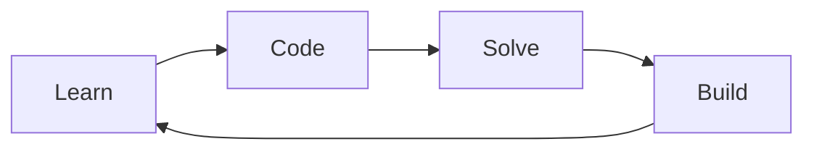

  

  

---

## 🧑‍💻 About Me

* 🎓 Engineering Student
* 💡 Love solving real-world problems
* 📚 Learning **C | Python | Java**
* ⚡ Motto: **Consistency > Motivation**
* 🚀 Goal: Become job-ready developer

---

## 🚀 Tech Stack

  

---

## 📊 GitHub Stats

  

  

---

## ⭐ Total Stars

  

---

## 🏆 GitHub Achievements

  

---

## 📊 Top Languages

  

---

## 🌐 Connect With Me

  
  
  

---

## 🎯 Current Focus

* 🔥 Improving **Logic Building**
* 🚀 Building **Real Projects**
* 🎯 Target: **First Tech Internship**
* 💻 Daily: **Code + Learn + Build**

---

## ⚡ Developer Loop

---

## 💡 Quote

> "First, solve the problem. Then, write the code."

---

## ⚡ Keep Coding

  

