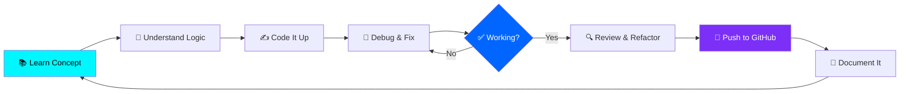

<p align="center">
  
</p>


<p align="center">
  
</p>

<p align="center">
  
  &nbsp;
  
  &nbsp;
  
  &nbsp;
  
</p>

---

<!-- ═══════════════════════════════════════════════ ABOUT ME ═══════════════════════════════════════════════ -->

## 🧑‍💻 About Me


```yaml
name        : Sanjeet Kumar
role        : Engineering Student → Aspiring Software Developer
location    : India 🇮🇳
focus       : Frontend Development & Problem Solving
status      : Actively building & learning every day
available   : Open to internships, projects & collaborations
motto       : "Consistency > Motivation 🚀"
superpower  : Turning fundamentals into real-world projects
```

- 🎓 Engineering student passionate about software development
- 💡 I learn by **building real things**, not just watching tutorials
- 🌱 Currently sharpening **DSA** and **JavaScript** skills
- 🤝 Always open to connecting with fellow developers
- 🎯 **2026 Goal** — Land my first software internship
- ⚡ **Fun fact** — I debug with `console.log` and I'm not ashamed 😄

<br clear="both"/>

---

<!-- ═══════════════════════════════════════════════ CURRENT FOCUS ═══════════════════════════════════════════════ -->

## 🎯 Current Focus

<p align="center">
  
</p>

<div align="center">

| 🔬 Learning | 🔨 Building | 🎯 Targeting |
|:-----------:|:-----------:|:------------:|
| Data Structures & Algorithms | Frontend Mini-Projects | Software Internships |
| JavaScript DOM & ES6+ | Logic-Based Programs | Open Source PRs |
| C++ Problem Solving | GitHub Portfolio | Dev Communities |
| Python Scripting | Real-World Clones | Coding Competitions |

</div>

---

<!-- ═══════════════════════════════════════════════ TECH STACK ═══════════════════════════════════════════════ -->

## 🛠️ Tech Stack & Tools

<p align="center">
  
</p>

<p align="center">

**Languages**


**Frontend**


**Tools & Platforms**


**Learning Next**


</p>

---

<!-- ═══════════════════════════════════════════════ DEVELOPER ROADMAP ═══════════════════════════════════════════════ -->

## 🗺️ Developer Roadmap

<p align="center">
  
</p>

```
🛣️  MY DEVELOPER JOURNEY ROADMAP
━━━━━━━━━━━━━━━━━━━━━━━━━━━━━━━━━━━━━━━━━━━━━━━━━━━━━━━━━━

  ✅  PHASE 1 — FOUNDATIONS         [COMPLETED]
      ├── C Programming Basics
      ├── C++ OOP Concepts
      ├── Python Scripting
      └── HTML & CSS Fundamentals

  🔄  PHASE 2 — BUILD & CREATE      [IN PROGRESS]
      ├── JavaScript DOM Manipulation
      ├── Responsive Frontend Projects
      ├── Git & GitHub Workflow
      └── Real-World Project Portfolio

  🔄  PHASE 3 — THINK & SOLVE       [IN PROGRESS]
      ├── Data Structures (Arrays, LL, Stacks, Trees)
      ├── Algorithms (Sorting, Searching, DP)
      ├── LeetCode Daily Practice
      └── Competitive Programming

  ⏳  PHASE 4 — GROW & SHIP         [UPCOMING]
      ├── React.js + Node.js
      ├── Open Source Contributions
      ├── Internship Applications
      └── Full-Stack Mini Projects

━━━━━━━━━━━━━━━━━━━━━━━━━━━━━━━━━━━━━━━━━━━━━━━━━━━━━━━━━━
```

---

<!-- ═══════════════════════════════════════════════ DEVELOPER WORKFLOW ═══════════════════════════════════════════════ -->

## 🔄 Developer Workflow



---

<!-- ═══════════════════════════════════════════════ GITHUB STATS ═══════════════════════════════════════════════ -->

## 📊 GitHub Statistics

<p align="center">
  
  &nbsp;&nbsp;
  
</p>

---

<!-- ═══════════════════════════════════════════════ STREAK ═══════════════════════════════════════════════ -->

## 🔥 GitHub Streak

<p align="center">
  
</p>

---

<!-- ═══════════════════════════════════════════════ CONTRIBUTION GRAPH ═══════════════════════════════════════════════ -->

## 📈 Contribution Graph

<p align="center">
  
</p>

---

<!-- ═══════════════════════════════════════════════ PROFILE SUMMARY CARDS ═══════════════════════════════════════════════ -->

## 📋 Profile Summary

<p align="center">
  
</p>

<p align="center">
  
  &nbsp;
  
</p>

---


---

<!-- ═══════════════════════════════════════════════ CODING PROFILES ═══════════════════════════════════════════════ -->

## 💻 Coding Profiles

<p align="center">

<!-- 🔗 REPLACE with your actual profile links below -->

[](https://leetcode.com/u/sanjeet1234/)
&nbsp;

[](https://www.geeksforgeeks.org/profile/sumitkumauqt3)
&nbsp;
[](https://www.hackerrank.com/profile/sumitkumar989159)

</p>

<div align="center">

| Platform | Focus | Status |
|:--------:|:-----:|:------:|
| 🟡 LeetCode | DSA & Algorithms | 🔄 Active |
| 🟢 GeeksforGeeks | CS Fundamentals | 🔄 Active |
| 🟩 HackerRank | Problem Solving | 🔄 Active |

</div>

---

<!-- ═══════════════════════════════════════════════ FEATURED PROJECTS ═══════════════════════════════════════════════ -->

## 🚀 Featured Projects

<p align="center">
  
</p>

<div align="center">

<!-- 🔗 REPLACE project names, descriptions, and links with your actual projects -->

| 🗂️ Project | 📝 Description | 🛠️ Tech Stack | 🔗 Links |
|:----------:|:--------------:|:-------------:|:--------:|
| **Portfolio Website** | Personal dev portfolio with smooth animations | HTML, CSS, JS | [Live](#) · [Code](https://github.com/sanjeetkumar989159-hub) |
| **Calculator App** | Functional calculator with keyboard support | HTML, CSS, JS | [Live](#) · [Code](https://github.com/sanjeetkumar989159-hub) |
| **DSA Visualizer** | Visual tool for sorting algorithm understanding | Python / JS | [Live](#) · [Code](https://github.com/sanjeetkumar989159-hub) |
| **To-Do App** | Task manager with local storage persistence | HTML, CSS, JS | [Live](#) · [Code](https://github.com/sanjeetkumar989159-hub) |
| **Weather App** | Real-time weather using public API | HTML, CSS, JS | [Live](#) · [Code](https://github.com/sanjeetkumar989159-hub) |

</div>

> 💡 *More projects coming soon — follow along the journey!*

---

<!-- ═══════════════════════════════════════════════ LEARNING JOURNEY TIMELINE ═══════════════════════════════════════════════ -->

## 🕰️ Learning Journey Timeline

```
📅  LEARNING TIMELINE
━━━━━━━━━━━━━━━━━━━━━━━━━━━━━━━━━━━━━━━━━━━━━━━━

  2025  ──►  Started Engineering
              └── First "Hello World" in C 🎉

  2025 ──►  Language Expansion
              ├── Learned C++ & OOP concepts
              └── Wrote first Python script 🐍

  2025  ──►  Web Development Entry
              ├── Built first HTML/CSS page
              ├── Started JavaScript DOM
              └── Created first GitHub repo 📂

  2026 ──►  Serious Developer Mode ON 🔥
              ├── Consistent GitHub commits
              ├── Started DSA journey
              ├── Built portfolio projects
              └── Joined coding communities


━━━━━━━━━━━━━━━━━━━━━━━━━━━━━━━━━━━━━━━━━━━━━━━━
```

---

<!-- ═══════════════════════════════════════════════ DEVELOPER MINDSET ═══════════════════════════════════════════════ -->

## 🧠 Developer Mindset

<p align="center">
  
</p>

<div align="center">

```
╔══════════════════════════════════════════════════════╗
║                  DEVELOPER MINDSET                   ║
╠══════════════════════════════════════════════════════╣
║  🔍  Problem-first thinking before writing code      ║
║  📖  Learn → Build → Break → Fix → Repeat            ║
║  🤝  Collaboration accelerates growth                 ║
║  📝  Document your code — future-you will thank you  ║
║  🔄  Refactor ruthlessly, ship consistently           ║
║  💪  Progress over perfection, always                 ║
╚══════════════════════════════════════════════════════╝
```

</div>

---

<!-- ═══════════════════════════════════════════════ ACHIEVEMENTS ═══════════════════════════════════════════════ -->

## 🏅 Achievements

<div align="center">

| 🏆 Achievement | 📅 When | 🔥 Impact |
|:--------------:|:-------:|:---------:|
| First GitHub Repo | 2025 | Started public dev journey |
| Built First Web Project | 2026 | Real frontend experience |
| Consistent GitHub Streak | 2026 | Discipline & consistency |
| Started DSA Journey | 2026 | Problem-solving skills |

</div>

---

<!-- ═══════════════════════════════════════════════ 2026 GOALS ═══════════════════════════════════════════════ -->

## 🎯 2026 Goals Checklist

```
🗓️  GOALS FOR 2026
━━━━━━━━━━━━━━━━━━━━━━━━━━━━━━━━━━━━

  TECHNICAL GOALS
  ☐  Build 5+ frontend projects
  ☐  Learn React.js fundamentals
  ☐  Contribute to 3+ open source repos
  ☐  Master JavaScript ES6+ features

  CAREER GOALS
  ☐  Land a software development internship
  ☐  Build a professional portfolio website
  ☐  Connect with 100+ developers
  ☐  Complete a real-world project for a client

  CONSISTENCY GOALS
  ☑  Push code to GitHub every week
  ☐  Maintain a 30-day coding streak
  ☐  Write my first dev blog post
  ☐  Complete a full online course

━━━━━━━━━━━━━━━━━━━━━━━━━━━━━━━━━━━━
```

---

<!-- ═══════════════════════════════════════════════ DEVELOPER PRINCIPLES ═══════════════════════════════════════════════ -->

## 💎 Developer Principles

<p align="center">

```
┌─────────────────────────────────────────────────────────┐
│                                                         │
│   01 ·  Write code for humans first, machines second   │
│   02 ·  Understand the problem before writing a line   │
│   03 ·  Small, consistent progress beats bursts        │
│   04 ·  Ask questions — it's a sign of intelligence    │
│   05 ·  Always be the junior somewhere new             │
│   06 ·  Share what you learn — it cements the lesson   │
│   07 ·  Done > Perfect when starting out               │
│   08 ·  Google is a skill, not a cheat code            │
│                                                         │
└─────────────────────────────────────────────────────────┘
```

</p>

---

<!-- ═══════════════════════════════════════════════ FUN FACTS ═══════════════════════════════════════════════ -->

## ⚡ Fun Facts About Me

<div align="center">

```
🎮  I treat debugging like a detective game — I love finding the culprit
☕  Coffee + music + code = my perfect dev environment
🌙  My best ideas come after 10 PM (classic developer hours)
🔁  I rewrite code not because it's broken, but because I learned better
📱  My phone gallery is full of code snippets I photographed
🧩  I actually enjoy logic puzzles — that's why I love programming
🌐  I've googled "how to center a div" more than once. No shame.
🚀  My first deployment felt like launching a rocket 🛸
```

</div>

---

<!-- ═══════════════════════════════════════════════ DAILY ROUTINE ═══════════════════════════════════════════════ -->

## ⏰ My Daily Developer Routine

```
📅  A DAY IN MY DEVELOPER LIFE
━━━━━━━━━━━━━━━━━━━━━━━━━━━━━━━━━━━━━━━━━━━━

  🌅  06:00  Wake up, quick review of yesterday's code
  📚  07:00  College / Classes / Lectures
  🍽️  13:00  Lunch + read tech articles
  💻  14:00  Code & build projects (2–3 hrs)
  🧩  17:00  DSA practice on LeetCode / GFG
  🌐  19:00  GitHub — commit the day's progress
  📖  20:00  Watch tutorials / read docs
  🌙  22:00  Review day's learnings + plan tomorrow
  😴  23:30  Sleep (healthy dev = productive dev)

━━━━━━━━━━━━━━━━━━━━━━━━━━━━━━━━━━━━━━━━━━━━
```

---

<!-- ═══════════════════════════════════════════════ RANDOM DEV QUOTE ═══════════════════════════════════════════════ -->

## 💬 Dev Quote of the Day

<p align="center">
  
</p>

<p align="center">
  
  &nbsp;
  
</p>

---

<!-- ═══════════════════════════════════════════════ GITHUB METRICS ═══════════════════════════════════════════════ -->

## 📡 GitHub Metrics

<p align="center">
  
</p>

<p align="center">
  
</p>

---

<!-- ═══════════════════════════════════════════════ SUPPORT ME ═══════════════════════════════════════════════ -->

## ❤️ Support My Journey

<p align="center">
  <i>If my work, projects, or journey inspire you even a little — here's how you can support:</i>
</p>

<p align="center">
  <a href="https://www.buymeacoffee.com/YOUR_USERNAME">
    <!-- 🔗 REPLACE: Update the BuyMeACoffee link with your actual username -->
    
  </a>
  &nbsp;
  <a href="https://github.com/sanjeetkumar989159-hub?tab=repositories">
    
  </a>
  &nbsp;
  <a href="https://github.com/sanjeetkumar989159-hub">
    
  </a>
</p>

---

<!-- ═══════════════════════════════════════════════ CONNECT WITH ME ═══════════════════════════════════════════════ -->

## 🤝 Let's Connect!

<p align="center">
  
</p>

<p align="center">
  <a href="mailto:sumitkumar989159@gmail.com">
    
  </a>
  &nbsp;
  <a href="https://www.linkedin.com/in/sanjeet-kumar-706597s" target="_blank">
    
  </a>
  &nbsp;
  <a href="https://github.com/sanjeetkumar989159-hub" target="_blank">
    
  </a>
</p>


---

<!-- ═══════════════════════════════════════════════ VISITOR COUNTER ═══════════════════════════════════════════════ -->

## 👁️ Visitor Counter

<p align="center">
  
  &nbsp;
  
  &nbsp;
  
</p>

<p align="center">
  <i>Thanks for visiting my profile! Every view motivates me to keep building 🙏</i>
</p>

---

<!-- ═══════════════════════════════════════════════ FOOTER ═══════════════════════════════════════════════ -->

<p align="center">
  
</p>

<p align="center">
  <b>⭐ If you find my profile or projects helpful, a star goes a long way — thank you! ⭐</b>
  <br/><br/>
  
  &nbsp;
  
  &nbsp;
  
</p>
