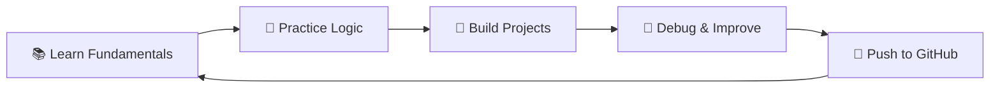

  

  

  
  
  
  

---

## 👋 About Me

Hey there! I'm **Sanjeet Kumar**, an engineering student on a mission to become a skilled software developer. I focus on building strong programming fundamentals and turning that knowledge into real, working projects.

- 🎓 **Engineering Student** — learning every single day
- 💻 **Aspiring Software Developer** — frontend & logic focused
- 🌱 **Currently learning** — C, C++, Python, Java, HTML, CSS, JavaScript
- 🚀 **Building** — frontend and logic-based real-world projects
- 🎯 **Goal** — become internship-ready and job-ready
- ⚡ **Motto** — *Consistency > Motivation*

 

---

## 🎯 Current Focus

  

---

## 🛠️ Tech Stack

  

  
  
  
  
  
  
  
  
  
  

---

## 🚀 Featured Project

### 🛒 APNA MART — Grocery Delivery Web App

> A fully functional, modern grocery delivery web application built with **HTML, CSS, and JavaScript** — no frameworks, just fundamentals done right.

  
  &nbsp;
  

<b>✨ Key Features (click to expand)</b>

 

| Feature | Description |
|---|---|
| 🗂️ Product Categories | Browse items organized by category |
| 🔍 Search & Filter | Find products quickly with real-time search |
| 🛒 Cart Management | Add items, update quantities, remove products |
| ❤️ Wishlist | Save favorite items for later |
| 🏷️ Coupons & Discounts | Apply promo codes at checkout |
| 📦 Order History | View past orders |
| 🚚 Delivery Tracking | Simulated delivery status updates |
| 🌙 Dark / Light Mode | Toggle between themes |
| 📱 Fully Responsive | Works seamlessly on all screen sizes |

---

## 📊 GitHub Statistics

  
  &nbsp;
  

---

## 🔥 GitHub Streak

  

---

## 📈 Contribution Graph

  

---

## 📊 Profile Summary

  

  
  

---

## 🧠 Developer Workflow

---

## 🤝 Connect With Me

  
  &nbsp;
  
  &nbsp;
  

  <i>💬 Feel free to reach out — always open to connecting with fellow developers!</i>

---

  

  <b>⭐ If you find my work helpful, consider starring my repos!</b>

