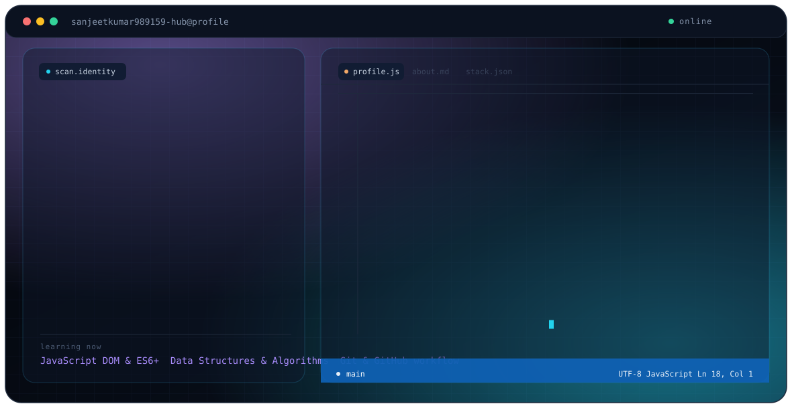

  <picture>
    <source media="(prefers-color-scheme: dark)" srcset="./dark.svg" />
    <source media="(prefers-color-scheme: light)" srcset="./light.svg" />
    
  </picture>

 

## About

Engineering student learning by building real projects rather than only watching tutorials. Currently sharpening data structures & algorithms and JavaScript, with a focus on frontend development. Aiming to land a first software internship in 2026.

## Focus

- Data structures & algorithms
- JavaScript DOM & ES6+
- Responsive frontend projects
- Growing a GitHub portfolio

## Stack

`C` · `C++` · `Python` · `Java` · `JavaScript` · `HTML` · `CSS` · `Git` · `GitHub` · `VS Code`

Currently learning: `React` · `Node.js`

## Projects

| Project | Description |
|---|---|
| Portfolio Website | Personal dev portfolio with smooth animations |
| Calculator App | Functional calculator with keyboard support |
| DSA Visualizer | Visual tool for sorting algorithm understanding |
| To-Do App | Task manager with local storage persistence |
| Weather App | Real-time weather lookup using a public API |

See the code for these on [GitHub](https://github.com/sanjeetkumar989159-hub).

## Coding profiles

## GitHub contributions

  <picture>
    <source media="(prefers-color-scheme: dark)" srcset="https://raw.githubusercontent.com/sanjeetkumar989159-hub/github-snake/output/github-snake-dark.svg" />
    <source media="(prefers-color-scheme: light)" srcset="https://raw.githubusercontent.com/sanjeetkumar989159-hub/github-snake/output/github-snake.svg" />
    
  </picture>

> This section needs a one-time setup: create a `github-snake` repo and Actions workflow as described in the setup guide, so GitHub generates those two SVGs on your account. Until that's done, the images above won't load.

## Connect

