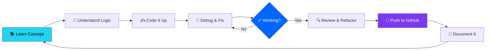

  <picture>
    <source media="(prefers-color-scheme: dark)" srcset="./dark.svg" />
    <source media="(prefers-color-scheme: light)" srcset="./light.svg" />
    
  </picture>

  

  
  &nbsp;
  
  &nbsp;
  
  &nbsp;
  









## 🔄 Developer Workflow


```mermaid
graph LR
    A[📚 Learn Concept] --> B[🧩 Understand Logic]
    B --> C[✍️ Code It Up]
    C --> D[🐛 Debug & Fix]
    D --> E{✅ Working?}
    E -- No --> D
    E -- Yes --> F[🔍 Review & Refactor]
    F --> G[🚀 Push to GitHub]
    G --> H[📝 Document It]
    H --> A

    style A fill:#22D3EE,color:#000
    style G fill:#7C3AED,color:#fff
    style E fill:#0066FF,color:#fff
```

## 📊 GitHub Statistics

  
  

## 🔥 GitHub Streak

  

## 📈 Contribution Graph

  

## 🐍 GitHub Contributions

  <picture>
    <source media="(prefers-color-scheme: dark)" srcset="https://raw.githubusercontent.com/sanjeetkumar989159-hub/github-snake/output/github-snake-dark.svg" />
    <source media="(prefers-color-scheme: light)" srcset="https://raw.githubusercontent.com/sanjeetkumar989159-hub/github-snake/output/github-snake.svg" />
    
  </picture>

## 📋 Profile Summary

  

  
  &nbsp;
  

## 💻 Coding Profiles

&nbsp;

&nbsp;

Browse the code on <a href="https://github.com/sanjeetkumar989159-hub?tab=repositories">GitHub</a>.















## 💬 Dev Quote of the Day

  

## 📡 GitHub Metrics

  
  

## 🤝 Let's Connect!

  

  
  &nbsp;
  
  &nbsp;
  

  
  &nbsp;
  

  
  &nbsp;
  
  &nbsp;
  

  

